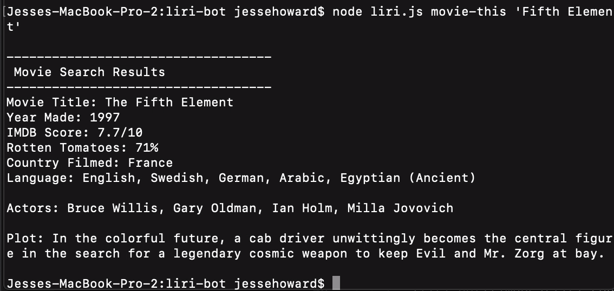

# L.I.R.I. Bot
## A _Language_ Interpertation and Recognition Interface

### Overview

In this project I built a simple command-line node application that recieves user commands and search terms and output revelant data in the console.

### Purpose

AI, machine learning, and useful intepertation of user input and extraploating is becoming more and more common place. This app uses Node.js (a server-size Javascript command-line enviorment) to take user input and search different web sources and local log files using web APIs and NPM node modules.

- - - 

### How to Use

LIRI accepts four differnt types of commands for user input.

   * **concert-this** 

   * **spotify-this-song**

   * **movie-this**

   * **do-what-it-says**

In your bash or terminal window simply type:

      node liri.js command-name 'search string'

Where the **command-name** is literally one of the four commands listed above (no spaces or quotes) and the **search string** is either an Artist, Movie Title, or Song name etc enclosed in single quotes.

## Visual Examples of the four main LIRI commands:

  1. **concert-this**
      * This command uses the Bands In Town Web API to search for upcoming concerts.
      * Command: **concert-this**
      * Search String: any Band or Artist Name.
      * Example:
      
            node liri.js concert-this 'incubus'

      

      * Sample Result:

      

  2. **spotify-this-song**
      * This command uses the Spotify Web API to search for song details.
      * Command: **spotify-this-song**
      * Search String: any Song Name.
      * Example:
      
            node liri.js spotify-this-song 'Black Magic Woman'

      

      * Sample Result:

      

  3. **movie-this**
      * This command uses the OMDB Web API to search for movie details.
      * Command: **movie-this**
      * Search String: optional*, otherwise any Movie Title or Name.
      * Example:
      
            node liri.js movie-this 'Fifth Element'

      

      * Sample Result:

      

      * If the search string is omitted then this command defaults to searching for the movie Mr. Nobody!
      * Example:
      
            node liri.js movie-this

      

  4. **do-what-it-says**
      * This command takes text saved within a local random.txt file and uses its contents as parameters to run a command. In this example the text file contains:

            spotify-this-song,"I Want it That Way"

      * **Command:** do-what-it-says
      * **Search String:** None.
      * Example:

            node liri.js do-what-it-says

      

- - -

### Technology Used and Depencencies

LIRI is designed specififally to search Spotify for songs, Bands in Town for concerts, OMDB for movies, and NPM fs (included with the node.js install) for a log file saved to the local file system.

1. Step One: install NPM Modules
(NOTE: if cloning this project, you will need to 'npm install NAME-OF-MODULE' for each of the following modules where NAME-OF-MODULE is 'Node', 'Axios', 'Moment', or 'DotEnv' respectively see: https://docs.npmjs.com for details ).

  Required NPM Node Modules:
   * [Node](https://www.npmjs.com/package/node) - for back-end command-line javascript interface.

   * [Axios](https://www.npmjs.com/package/axios) - for javascript based api calls used for the OMBD API and Bands In Town API respectively.

   * [Moment](https://www.npmjs.com/package/moment) - for formatting the returned concert time search results.

   * [DotEnv](https://www.npmjs.com/package/dotenv) - for loading enviorment variables from .env files used to keep your individual Spotify API credentials private. To use this code you will need to create your OWN .env file in your root directory with the following details:

    ```js
    # Spotify API keys

    SPOTIFY_ID=your-spotify-id
    SPOTIFY_SECRET=your-spotify-secret

    ```
    Where the 'spotify-id' and 'your-spotify-secret' are personal keys obtained from your own Spotify Developer account.
    
2. Step Two: Get Your Own Spotify App API keys

  * Login or create a free spotify developer account by visiting: <https://developer.spotify.com/my-applications/#!/>

  * Then go here to create your own API app credentials: <https://developer.spotify.com/my-applications/#!/applications/create>.

  * Update the .env text file you created to your local directory with these new key values.

3. Step Three: GitIgnore
If you are using Git as your version tracking tool, you might want to also create a `.gitignore` file and add the following lines to it. This will tell git not to track these files, and thus they won't be committed to Github.

```
node_modules
.DS_Store
.env
```
- - - 

## Submission Guide
     * Edit the text in random.txt to test out the feature for movie-this and concert-this.

### BONUS

* In addition to logging the data to your terminal/bash window, output the data to a .txt file called `log.txt`.

* Make sure you append each command you run to the `log.txt` file. 

* Do not overwrite your file each time you run a command.
- - -

### Add To Your Portfolio

After completing the homework please add the piece to your portfolio. Make sure to add a link to your updated portfolio in the comments section of your homework so the TAs can easily ensure you completed this step when they are grading the assignment. To receive an 'A' on any assignment, you must link to it from your portfolio.